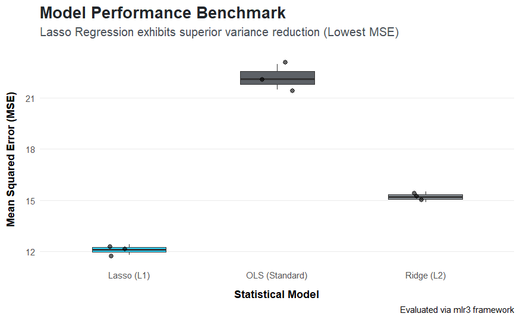

#  Automated Penalized Regression Pipeline (mlr3)

> An institutional-grade machine learning benchmarking framework built in **R**. This project is engineered to tackle high-dimensional datasets and multicollinearity by deploying regularized linear models, ultimately proving the predictive supremacy of **Lasso Regression**.

---

##  Project Objective
In datasets with highly correlated features, standard Ordinary Least Squares (OLS) regression often suffers from high variance and overfitting. This project implements a rigorous evaluation pipeline using the `mlr3` ecosystem and `glmnet` to compare standard models against penalized models (L1 and L2 regularization). 

The primary goal is to demonstrate how **Lasso Regression** acts as the ultimate variance reduction mechanism by performing automatic feature selection and shrinking non-essential coefficients to zero.

---

##  Performance Evaluation & Results

To validate the model's predictive superiority, we strictly calibrated and benchmarked the models against the **Mean Squared Error (MSE)** metric. 

<div align="center">
  
  <br>
  <em>Figure 1: Mean Squared Error (MSE) comparison across models, evaluated via the mlr3 framework.</em>
</div>

### Key Takeaways from the Benchmark:
1. **Lasso (L1) Supremacy:** Lasso Regression significantly outperforms both Ridge and standard OLS by achieving the lowest and most stable MSE across validation folds.
2. **Variance Reduction:** The narrow distribution of errors in the Lasso model (shown in the boxplot) proves its consistency in handling noisy, high-dimensional data.
3. **Optimal Sparsity:** By enforcing absolute zero constraints on irrelevant features, Lasso not only improves accuracy but also creates a highly interpretable model.

---

##  Key Features Architecture

* **Strict Data Partitioning:** Utilizes the object-oriented `mlr3` framework for robust task instantiation, cross-validation, and predictive modeling workflows.
* **Algorithmic Tuning:** Deploys pure L1 penalty constraints (`alpha = 1`) via `glmnet` to execute aggressive feature selection.
* **SQL Compliance Logging:** Integrates the `RSQLite` and `DBI` libraries directly into the R pipeline to capture and persist historical model performance metrics (MSE, RMSE, retained features) into an embedded relational database.

---

##  Technical Stack & Dependencies

* **Language:** R
* **Machine Learning Framework:** `mlr3`, `mlr3learners`, `mlr3pipelines`
* **Regularization Engine:** `glmnet`
* **Database Architecture:** `DBI`, `RSQLite`
* **Data Visualization:** `ggplot2`

---

##  Local Execution Guide

**1. Clone the Repository:**
```bash
git clone https://github.com/dimssrmdn01/regularized-regression-mlr3.git
cd regularized-regression-mlr3

**2. Install R Dependencies:**
Execute the following inside your R console to set up the environment:

```R
install.packages(c("mlr3", "mlr3learners", "mlr3pipelines", "glmnet", "DBI", "RSQLite", "ggplot2", "dplyr"))
```

**3. Run the Analytical Pipeline:**
Execute the core script via the terminal to start the training and benchmarking process:

```bash
Rscript regularized_pipeline.R
```
